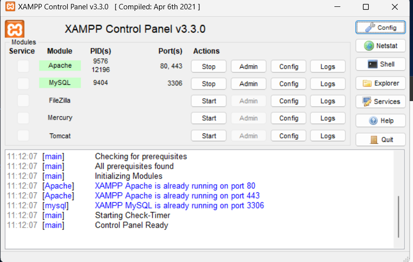
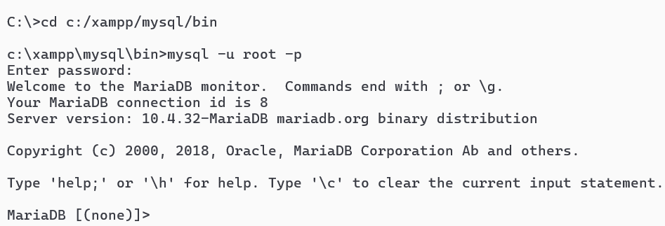
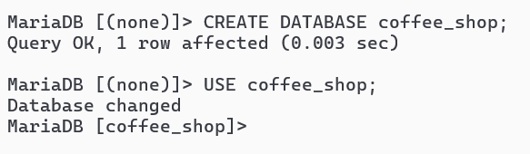
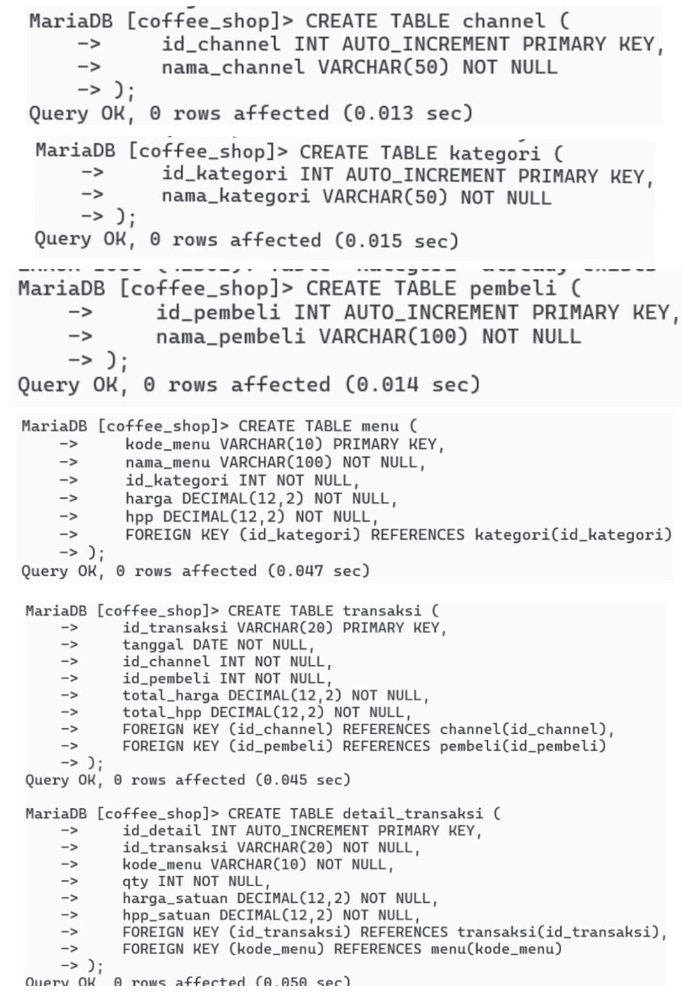
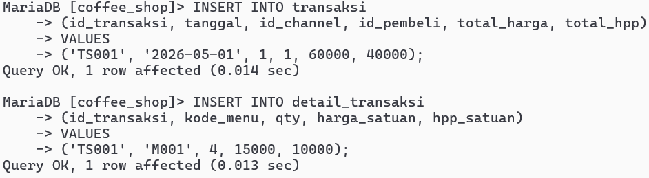
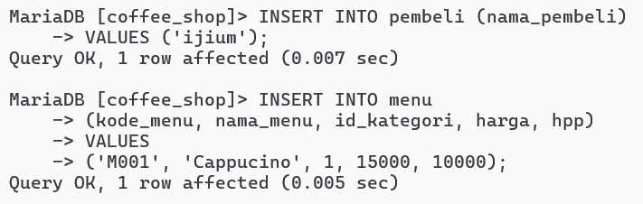
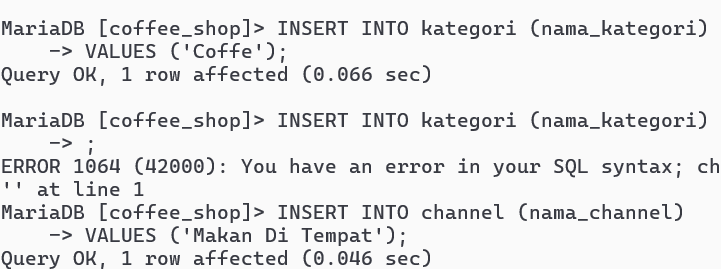
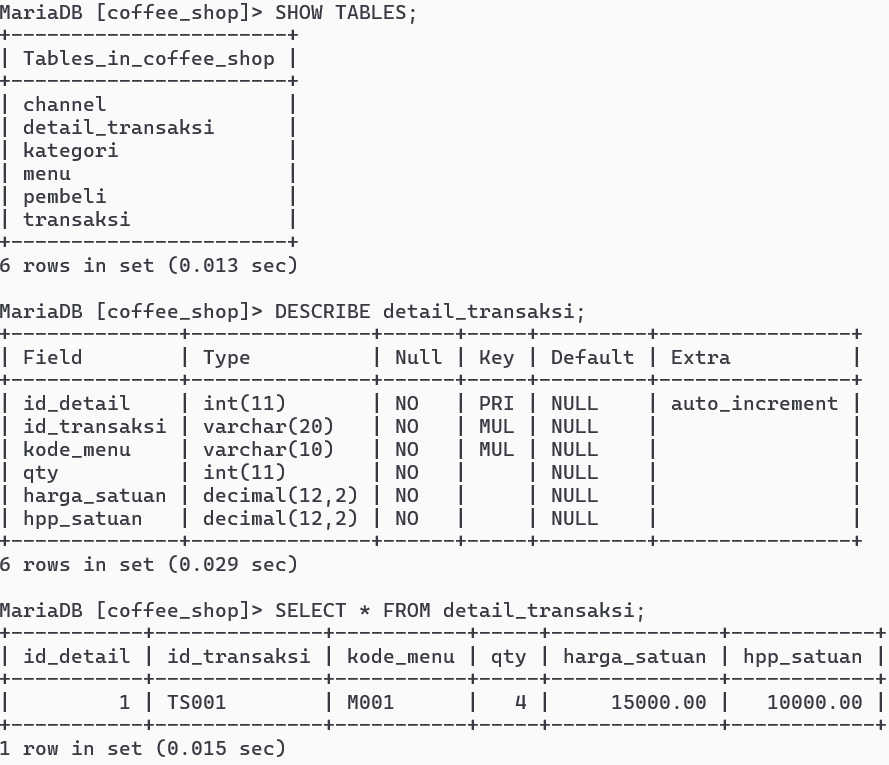

# Dokumentasi Implementasi Database 3NF di MySQL

Studi kasus: Coffee Shop
Database: `coffee_shop` (tabel `kategori`, `channel`, `pembeli`, `menu`, `transaksi`, `detail_transaksi`)
Aplikasi: XAMPP (MariaDB 10.4.32) melalui Command Prompt

---

## 1. Menjalankan MySQL di XAMPP

Buka XAMPP Control Panel, lalu klik **Start** pada Apache dan MySQL. Kalau berhasil, namanya berwarna hijau dan port 3306 muncul.



---

## 2. Masuk ke MySQL lewat Command Prompt

Pindah ke folder `bin` milik XAMPP, lalu login sebagai `root`. Setelah itu prompt berubah menjadi `MariaDB [(none)]>`.

```
cd c:/xampp/mysql/bin
mysql -u root -p
```



---

## 3. Membuat dan memilih database

```sql
CREATE DATABASE coffee_shop;
USE coffee_shop;
```

Database dibuat, lalu dipilih supaya semua tabel masuk ke sini. Prompt sekarang menjadi `MariaDB [coffee_shop]>`.



---

## 4. Membuat tabel 3NF

Tabel induk dibuat lebih dulu (`channel`, `kategori`, `pembeli`), lalu `menu`, `transaksi`, dan terakhir `detail_transaksi`, karena tabel yang punya FK butuh tabel tujuannya sudah ada.

```sql
CREATE TABLE channel (
  id_channel INT AUTO_INCREMENT PRIMARY KEY,
  nama_channel VARCHAR(50) NOT NULL
);

CREATE TABLE kategori (
  id_kategori INT AUTO_INCREMENT PRIMARY KEY,
  nama_kategori VARCHAR(50) NOT NULL
);

CREATE TABLE pembeli (
  id_pembeli INT AUTO_INCREMENT PRIMARY KEY,
  nama_pembeli VARCHAR(100) NOT NULL
);

CREATE TABLE menu (
  kode_menu VARCHAR(10) PRIMARY KEY,
  nama_menu VARCHAR(100) NOT NULL,
  id_kategori INT NOT NULL,
  harga DECIMAL(12,2) NOT NULL,
  hpp DECIMAL(12,2) NOT NULL,
  FOREIGN KEY (id_kategori) REFERENCES kategori(id_kategori)
);

CREATE TABLE transaksi (
  id_transaksi VARCHAR(20) PRIMARY KEY,
  tanggal DATE NOT NULL,
  id_channel INT NOT NULL,
  id_pembeli INT NOT NULL,
  total_harga DECIMAL(12,2) NOT NULL,
  total_hpp DECIMAL(12,2) NOT NULL,
  FOREIGN KEY (id_channel) REFERENCES channel(id_channel),
  FOREIGN KEY (id_pembeli) REFERENCES pembeli(id_pembeli)
);

CREATE TABLE detail_transaksi (
  id_detail INT AUTO_INCREMENT PRIMARY KEY,
  id_transaksi VARCHAR(20) NOT NULL,
  kode_menu VARCHAR(10) NOT NULL,
  qty INT NOT NULL,
  harga_satuan DECIMAL(12,2) NOT NULL,
  hpp_satuan DECIMAL(12,2) NOT NULL,
  FOREIGN KEY (id_transaksi) REFERENCES transaksi(id_transaksi),
  FOREIGN KEY (kode_menu) REFERENCES menu(kode_menu)
);
```

Keenam tabel berhasil dibuat (`Query OK, 0 rows affected`).



---

## 5. Mengisi data (1 baris per tabel)

Pengisian juga dimulai dari tabel induk. ID yang memakai `AUTO_INCREMENT` terisi otomatis, jadi tidak perlu diketik.

**a. Kategori dan channel**

```sql
INSERT INTO kategori (nama_kategori) VALUES ('Coffe');
INSERT INTO channel (nama_channel) VALUES ('Makan Di Tempat');
```



**b. Pembeli dan menu**

```sql
INSERT INTO pembeli (nama_pembeli) VALUES ('ijium');
INSERT INTO menu (kode_menu, nama_menu, id_kategori, harga, hpp)
VALUES ('M001', 'Cappucino', 1, 15000, 10000);
```



**c. Transaksi dan detail transaksi**

```sql
INSERT INTO transaksi (id_transaksi, tanggal, id_channel, id_pembeli, total_harga, total_hpp)
VALUES ('TS001', '2026-05-01', 1, 1, 60000, 40000);

INSERT INTO detail_transaksi (id_transaksi, kode_menu, qty, harga_satuan, hpp_satuan)
VALUES ('TS001', 'M001', 4, 15000, 10000);
```

Semua perintah menghasilkan `Query OK, 1 row affected`.



---

## 6. Memeriksa tabel dan isinya

```sql
SHOW TABLES;
DESCRIBE detail_transaksi;
SELECT * FROM detail_transaksi;
```

- `SHOW TABLES` menampilkan daftar tabel di database.
- `DESCRIBE` menampilkan kolom, tipe data, dan tanda `PRI` (primary key) atau `MUL` (foreign key).
- `SELECT *` menampilkan isi tabel, yaitu 1 baris untuk TS001.



---

## 7. Menggabungkan tabel dengan JOIN

```sql
SELECT t.id_transaksi, t.tanggal, p.nama_pembeli, c.nama_channel,
       m.nama_menu, k.nama_kategori, d.qty
FROM detail_transaksi d
JOIN transaksi t ON d.id_transaksi = t.id_transaksi
JOIN menu m ON d.kode_menu = m.kode_menu
JOIN kategori k ON m.id_kategori = k.id_kategori
JOIN channel c ON t.id_channel = c.id_channel
JOIN pembeli p ON t.id_pembeli = p.id_pembeli;
```

Query ini menggabungkan 6 tabel lewat relasi FK. Dari data contoh, hasilnya satu baris: TS001, 2026-05-01, ijium, Makan Di Tempat, Cappucino, Coffe, 4. Artinya data yang sudah dipecah bisa disatukan lagi.


---

## Kesimpulan
Tabel hasil normalisasi 3NF berhasil dibuat di MySQL (MariaDB), dapat diisi data, dan dapat digabungkan kembali lewat JOIN tanpa kehilangan informasi.
